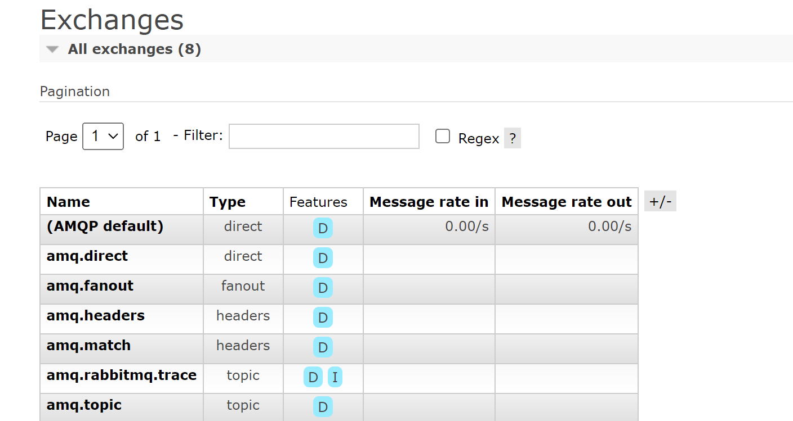

# Rabbit组成部分

### 1. Broker:`消息队列服务进程,此进程包括两个部分:`

- Exchange和Queue

> 1. Exchange: 消息队列交换机,按一定的规则将消息路由转发到某个队列,对消息进行过滤
>2. Queue:消息队列,存储消息的队列,消息到达队列并转发给指定的消费方

### 2. Producer: `消息生产者,即生产方客户端,生产方客户端将消息发送到MQ.`

### 3. Consumer: `消息消费者,即消费客户端,接收MQ转发的消息`

# 消息发布接收流程

发送消息

## 一 Rabbit初始化流程

### 1. 创建账号:

> 1. $ rabbitmqctl add_user admin 123

### 2. 设置用户角色

> 1. $ set_permissions [-p `<vhostpath>`]<user><conf><write><read>
>2. $ rabbitmqctl set_permissions -p "/" admin `".*"` `".*"` `".*"`
>3. **用户user_admin具有/vhost这个virtual host中所有资源的配置、写、读权限**

### 3. 常看当前用户和角色

> 1. $ rabbitmqctl list_users


## 二 引入依赖

```xml
<!--        rabbitmq依赖客户端-->
<dependency>
    <groupId>com.rabbitmq</groupId>
    <artifactId>amqp-client</artifactId>
    <version>5.13.1</version>
</dependency>
        <!--        操作文件流的一个依赖-->
<dependency>
<groupId>commons-io</groupId>
<artifactId>commons-io</artifactId>
<version>2.6</version>
</dependency>
```


## 三 Work Queues

> 工作队列(又称任务队列)的主要思想是`避免立即执行资源密集型任务`,而不得不等待它完成.相反我们安排任务之后执行.我们把`任务封装为消息`并将其发送到`队列`
> .在后台运行的工作进程将弹出任务并最终执行作业,当有多个工作线程时,这写工作线程将一起处理这些任务

### 3.1 轮询分发消息

> 在这个案例中我们会启动两个工作线程,一个`消息发送线程`,一个`消息接收线程`我们来看看他们两个工作线程是如何工作的

#### 3.1.1 抽取工具类

> RabbitUtils.class


### 3.2 消息应答

#### 3.2.1 概念

> 消费者完成一个任务可能需要一段时间,如果其中一个消费者处理一个长的任务并仅只完成了部分突然它挂掉了,
> 会发什么什么情况.RabbitMQ一旦向消费者传递了一条消息,便立即将该消息标记为删除.这种情况下,突然有个消费者挂掉了,
> 我们将丢失正在处理的消息.以及后续发送给该消费者的消息,因为它无法接收到.
> `为了保证消息在发送过程中不丢失,RabbitMQ,引入了消息应答机制,消息应答就是:消费者在接收到消息并且处理该消息之后,
> 告诉RabbitMQ它已经处理了,RabbitMQ可以把该消息删除了.`

#### 3.2.2 自动应答

> 消息发送后立即被认为已经传递成功,这种模式需要在`高吞吐量和数据传输安全性方面做权衡`,因为这种模式如果在消息接收到之前,
> 消费者那边出现连接或者channel关闭,那么消息就丢失了,当然另一方面这种模式消费者那边可以传递过载的消息,`没有对传递的消息数量进行限制`,
> 当然这样有可能使得消费者这边由于接受太多还来不及处理消息,没有对传递的消息数量进行限制,导致这些消息的挤压,最终使得内存耗尽,
> 最终这些消费者线程被操作系统杀死,所以`这些模式仅适用在消费者可以高效并以某种速率能够处理这些消息的情况下使用`

#### 3.2.3 消息应答方法:

> 1. Channel.basicAck(用于肯定确认): `RabbitMQ已知道该消息并且成功的处理消息,可以将其丢弃了`
> 2. Channel.basicNack(用于否定确认):
> 3. Channel.basicReject(用于否定确认): `与Channel.basicNack相比少了Multiple参数,不处理该消息直接拒绝,可以将其丢弃`

#### 3.2.4 Multiple解释

> 手动应答的好处是可以批量应答并且减少网络拥堵

```java
/**
 * true代表的就是Multiple参数
 */
channel.basicAck(deliveryTag,true);
```

> multiple的`true`和`false`代表不同意思
> 1:true: `代表批量应答channel上未应答的消息 比如说channel上有传送tag的消息5,6,7,8当前tag是8那么此时5-8的这些还未应答的消息都会被确认收到消息应答`
> 2:false: `只会应答tag=8的消息,5,6,7这三个消息依然不会确认收到消息应答`

#### 3.2.5 消息自动重新入队

> 如果消费者由于某些原因失去了连接(其通道已关闭,连接已关闭或TCP连接丢失),导致消息未发送ACK确认,RabbitMQ将了解到消息未完全处理,并将对其重新排队.如果
> 此时其它消费者可以处理,它将很快将其重新发给另一个消费者.这样,即使某个消费者偶尔掉线,也可以确保不会丢失任何消息

#### 3.2.6 消息手动应答

> AckByMyself.class

#### 3.2.7 手动应答效果演示

> 正常情况下消息发送方发送两个消息被两个消费者接收,在发送者发送消息dd,发出消息之后把消费者C2停掉,按理说该消费者2处理该消息,但是由于它处理时间较长,
> 在还未处理完,也就是说C2还没有执行ack代码的时候,消费者C2被停掉了,此时会看到消息被C1接收到了,说明消息dd被重新入队,然后分配给能处理消息的C1处理了

### 3.3 消息持久化

#### 3.3.1 概念

> 刚刚我们已经看到了如何处理任务不丢失的情况,但是如何保障当RabbitMQ服务停掉以后消息生产者发送过来的消息不丢失.默认情况下RabbitMQ退出或由于某种原因崩溃时,
> 它忽视队列和消息,除非告知它不要这样做.确保消息不会丢失需要做两件事: **我们需要将队列和消息都标记为持久化**

#### 3.3.2 队列如何实现持久化

> 之前我们创建的队列都是非持久化的,rabbitMQ如果重启的话,该队列就会被删除掉,如果要队列实现持久化 需要在声明队列的时候把durable参数设置为持久化

 ```java
boolean durable=true;
        channel.queueDeclare(QUEUE_NAME,durable,false,false,null);
```

> NOTICE: `但是需要注意的就是如果之前声明的队列不是持久化的,需要把原先队列先删除,或者重新创建一个持久化的队列,不然就会出现错误`

#### 3.3.3 消息持久化

> 要想让消息实现持久化需要在消息生产者修改代码`RabbitMQ3.Producer.java`,MessageProperties.PERSISTENT_TEXT_PLAIN添加这个属性

 ```java
channel.basicPublish("",QUEUE_NAME,null,message.getBytes("utf-8"));
        channel.basicPublish("",QUEUE_NAME,MessageProperties.PERSISTENT_TEXT_PLAIN,message,getBytes("utf-8"));
```

> 将消息标记为持久化并不能保证不会丢失消息.尽管它告诉RabbitMQ将消息保存到磁盘,但是这里依然存在时间间隙,即当消息刚准备存储在磁盘的时候(还没有存储完),
> 此时并没有真正写入磁盘,持久性保证不强,但是对于我们的简单任务队列而言,这已经绰绰有余了.如果需要更强有力的持久化策略,请继续阅读.

#### 3.3.4 不公平分发

> 在最开始的时候我们学习到RabbitMQ分发消息采用的轮询分发,但是在某种场景下这种策略并不是很好,比方说有两个消费者处理人任务,其中有个消费者1处理任务的速度非常快,而另外一个消费者2处理速度却很慢,
> 这个时候我们还是采用轮询分发的话就会造成时间浪费,效率不高,但是RabbitMQ并不知道这种情况依然是公平的进行分发(`像极了资本家,工资平等产出翻倍`)
`消费者方的代码`

```java
int prefetchCount=1;
        channel.basicQos(prefetchCount);
```

#### 3.3.5 预取值


``Prefetch=1表示设置该消费者对应的信道中最多可以存几条未处理的消息``

## 四 发布确认:

```java
  channel.confirmSelect();
```

### 4.1 发布确认原理

> 1.生产者将信道设置成confirm模式,一旦信道进入confirm模式,**所有在该信道上面发布的消息都会被指派一个唯一的ID**(从1开始),一旦消息被投递到所有匹配的队列之后,broker就会发送一个确认给生产者
> (包含消息的唯一ID),这就使得生产者知道消息已经正确到达目的队列了,如果消息和队列是可持久化的,那么确认消息会在将消息写入磁盘之后发出,broker回传给生产者的确认消息中delivery-tag域包含了确认消息的序列号,
> 此外broker也可以设置basic.ack的multiple域,表示到这个序列号之前的所有消息都已经得到了处理
>
> `confirm模式最大的好处在于它是异步的,一旦发布一条消息,生产者应用程序就可以在等信道返回确认的同时继续发送下一条消息,当消息最终得到确认之后,生产者应用便可以通过回调方法来处理该确认消息,如果RabbitMQ因为自身内部错误导致消息丢失,就会发送一条nack消息,生产者应用程序同样可以在回调方法中处理该nack消息`


### 4.2 发布确认作用

> 保证消息不会丢失

### 4.2.1 单个发布确认

> 这是一种简单的确认方式,它是一种**同步确认发布的方式**,也就是发布一个消息之后只有它被确认发布,后续的消息才能继续发布,waitForConfirmsOrDie(long)
> 这个方法只有在消息被确认的时候才返回,如果在指定时间范围内这个消息没有被确认那么它将排除异常
>
> > 这种确认方式有一个最大的缺点就是:**发布速度特别的慢**,因为如果没有确认发布的消息就会阻塞所有后续消息的发布,这种方式最多提供每秒不超过数百条发布消息的吞吐量.当然对于某些简单应用程序来说这可能已经足够了
>
> 经测试单个确认方法发送1000条数据耗时25433ms(`和电脑配置有关,但能表示该方法非常耗时`)
>

### 4.2.2 批量确认

> 上面那种方式非常慢,与单个等待确认消息相比,先发布一批消息然后一起确认可以极大地提高吞吐量,当然这种方式的缺点就是:
> 当发生故障导致发布出现问题时,不知道哪个消息出现问题了,我们必须将整个批处理保存在内存中,以记录重要的信息而后重新发布消息.当然这种方案任然是同步的,也是一样阻塞消息的发布
> > 经测试批量确认方法发送1000条数据耗时357ms(`虽然速度更快,但细粒度不够,不能够知道哪条消息没确认`)

### 4.2.3 异步确认

`RabbitMQ4.confirmMessage.java`
> 异步取人虽然编程逻辑比上两个复杂,但是性价比最高,无论是可靠性还是效率都没得说,它是利用回调函数来达到消息可靠性传递的,这个中间件也是通过函数回调来保证是否投递成功

### 4.2.4 异步处理未确认消息

> 最好的解决的解决方案就是把未确认的消息方法一个基于内存的能被发布线程访问的队列,比如说用ConcurrentLinkedQueue这个对列在confirm callbacks与发布线程之间进行消息的传递

### 4.2.5 以上三种发布确认速度对比

> 1. 单独发布消息
>> 同步等待确认,简单,但吞吐量非常有限
> 2. 批量发布消息
>> 批量同步等待确认,简单,吞吐量过得去,缺点也很明显,一旦出现问题很难判断是那条
> 3. 异步处理
>> 最佳性能和资源使用,在出现错误的情况下可以很好的控制,但是实现起来稍微难些

## 五 交换机


> &nbsp;&nbsp;&nbsp;&nbsp;&nbsp; 每个任务都交给一个消费者,但作为消费者,除了处理消息,可能还需要打印日志,如果把两件事都交给一个消费者做,则会出现高耦合,所以为了避免出现这种情况
> 我们需要将消息传递给多个消费者.  
> &nbsp;&nbsp;&nbsp;&nbsp;&nbsp;&nbsp;为了方便后续演示,我们将构建一个简单的日志系统.它将有两个程序组成
> > 1. 消费者1将接收消息后的日志存入磁盘
> >2. 消费者2将消息打印在控制台上.事实上第一个消费者将消息广播给所有消费者


### 5.1 Exchanges

#### 5.1.1 概念

> &nbsp;&nbsp;&nbsp;&nbsp;RabbitMQ消息传递模型的核心思想是: **生产者生产的消息从不会直接发送到队列**.实际上,通常生产者甚至都不知道这些消息传递到了哪些队列中  
> &nbsp;&nbsp;&nbsp;&nbsp;相反,**生产者只能将消息发送到交换机(exchange)**
> ,交换机工作的内容很简单,一方面它接受来自生产者的消息,另一方面它将他们推入队列.交换机必须确切知道如何处理收到的消息.是应该把这些
> 消息放到特定队列还是说把他们放到许多队列中还是应该丢弃它们.这就由交换机的类型来决定

#### 5.1.2 Exchanges类型

> `直接(direct),主题(topic),标题(headers),扇出(fanout)`

#### 5.1.3 无名

```java
channel.basicPublish("","QUEUE_NAME",null,message.getBytes());
```

> 第一个参数是交换机的名称.空字符串表示默认或无名称交换机: 消息能路由发送到队列中其实是由
> routingKey(bindKey)绑定key指定,如果它存在的话

### 5.2 临时队列

> 每当我们连接到rabbit时,我们都需要一个全新的空队列,为此我们可以创建一个**具有随机名称的队列**,或者能让服务器为我们选择一个随机队列名称那就更好了.其次**一旦我们断开了消费者的连接,队列将自动删除
`创建临时队列的方法如下: `

```java
String queueName=channel.queueDeclare().getQueue();
```

### 5.3 绑定 bindings

> 什么时binding呢,binding其实是exchange和queue之间的桥梁,它告诉我们exchange和那个队列进行了绑定关系.比如说下面这张图告诉我们的就是X与Q1和Q2进行了绑定


### 5.4 fanout

#### 5.4.1 fanout介绍

> fanout这种类型非常简单.它是接收到的所有消息**广播**到它知道的所有队列中.系统中默认有些exchange类型,代码中交换机类型参数`fanout`只能小写



### 5.5 Direct Exchange

> 绑定(bindings)是交换机和队列之间的桥梁关系.也可以这么理解;**`队列只对它绑定的交换机的消息感兴趣`**.绑定参数:routingKey来表示也可称该参数为binding key,创建绑定我们用代码
> **绑定之后意义由其交换类型决定**.
> ```java 
> channel.queueBind(queueName,EXCHANGE_NAME,"routingKey");
> ```  


> 在上面这张图中,我们可以看到X绑定了两个队列,绑定类型是direct.队列QUEUE2绑定键为routingKey3,
> 队列QUEUE1绑定键有两个: routingKey1,另一个绑定键为routingKey2

### 5.6 Topics Exchange

>
尽管使用direct交换机改进了我们的系统,但是它任然存在局限性-比方说我们想接收的日志类型由info,base和info.advantage,某个队列指向info,base消息,那这个时候direct就办不到了.这个时候就只能使用topic类型

#### 5.6.1 Topic的要求

> 发送到类型是topic交换机的消息的routing_key不能随意写,必须满足一定的要求,它必须是一个单调列表,以点号分隔开.这些单词可以是任意单词,比如说`"stock.usd.nyse,"nyse.vmw"`
> ,当然这些单词不能超过255个字节,
>
> 如果队列绑定键当中没有#和*出现,那么该队列类型就是direct了
>> 在这个规则列表中,其中有两个替换符是大家需要注意的
>>> 1. \* (星号)可以代替一个单词
>>>2. \#(井号)可以代替零个或多个单词

#### 5.6.2 Topic匹配案例


> 上面是一个队列绑定关系图,我们来看看他们之间数据接受情况是怎么样的
>> 1. quick.orange.rabbit &nbsp;&nbsp;&nbsp;&nbsp;&nbsp; 被队列Q1Q2接收到
>>  1. lazy.orange.elephant &nbsp;&nbsp;&nbsp;&nbsp;&nbsp; 被队列Q1Q2接收到

#### 5.6.4 实战

> 1. 声明交换机

 ```java
private static final String EXCHANGE_NAME="topic_logs";
public static void main(String[]args)throws IOException{
        Channel channel=RabbitUtils.getChannel();
        /**
         * 下图绑定关系如下
         * Q1-->绑定的是  中间带orange带3个单词的字符串(*.orange.*)
         * Q2-->绑定的是 最后一个单词是rabbit的3个单词(*.*.rabbit),第一个单词是lazy的多个单词(lazy.#)
         */
        channel.exchangeDeclare(EXCHANGE_NAME,BuiltinExchangeType.TOPIC);
        Map<String, String> bindingKeyMap=new HashMap<>();
        bindingKeyMap.put("quick.orange.rabbit","被队列Q1Q2接收到");
        bindingKeyMap.put("lazy.orange.elephant","被队列Q1Q2接收到");
        bindingKeyMap.put("quick.orange.fox","被队列Q1接收到");
        bindingKeyMap.put("lazy.brown.fox","被队列Q2接收到");
        bindingKeyMap.put("lazy.pink.rabbit","被队列Q2接收到");
        bindingKeyMap.put("quick.brown.fox","没队列接收");
        bindingKeyMap.put("quick.orange.male.rabbit","被队列Q2接收到");
        bindingKeyMap.put("lazy.orange.male.rabbit","被队列Q2接收到");
        for(Map.Entry<String, String> stringStringEntry:bindingKeyMap.entrySet()){
        String routingKey=stringStringEntry.getKey();
        String message=stringStringEntry.getValue();
        channel.basicPublish(EXCHANGE_NAME,routingKey,null,message.getBytes(StandardCharsets.UTF_8));
        System.out.println("生产者发出消息"+message);
        }
        }
```


> 2. 创建队列Q1

```java
 // 交换机的名称
public static final String EXCHANGE_NAME="topic_logs";
// 声明队列
public static final String QUEUE_NAME="Q1";
// 接收消息
public static void main(String[]args)throws Exception{
        Channel channel=RabbitUtils.getChannel();
        // 声明交换机
        channel.exchangeDeclare(EXCHANGE_NAME,"topic");
        channel.queueDeclare(QUEUE_NAME,false,false,false,null);
        channel.queueBind(QUEUE_NAME,EXCHANGE_NAME,"*.orange.*");
        System.out.println("等待接收消息....");
        //接收消息
        channel.basicConsume(QUEUE_NAME,true,
        ((consumerTag,message)->{
        System.out.println("接收到的消息为: "+new String(message.getBody(),"utf-8"));
        System.out.println("接收队列:  "+QUEUE_NAME+" 绑定键:  "+message.getEnvelope().getRoutingKey());
        }),((consumerTag,sig)->{

        }));
        }
```


> 3. 创建队列Q2

```java
 // 交换机的名称
public static final String EXCHANGE_NAME="topic_logs";
// 声明队列
public static final String QUEUE_NAME="Q2";
// 接收消息
public static void main(String[]args)throws Exception{
        Channel channel=RabbitUtils.getChannel();
        // 声明交换机
        channel.exchangeDeclare(EXCHANGE_NAME,"topic");
        channel.queueDeclare(QUEUE_NAME,false,false,false,null);
        channel.queueBind(QUEUE_NAME,EXCHANGE_NAME,"lazy.#");
        channel.queueBind(QUEUE_NAME,EXCHANGE_NAME,"*.*.rabbit");
        System.out.println("等待接收消息....");
        //接收消息
        channel.basicConsume(QUEUE_NAME,true,
        ((consumerTag,message)->{
        System.out.println("接收到的消息为: "+new String(message.getBody(),"utf-8"));
        System.out.println("接收队列:  "+QUEUE_NAME+" 绑定键:  "+message.getEnvelope().getRoutingKey());
        }),((consumerTag,sig)->{

        }));
        }
```


## 6.死信

### 6.1 死信概念

> 死信: 无法被消费的消息,一般来说,producer将消息投递到broker或者直接到queue里了,consumer从queue取出消息进行消费,但某些时候由于特定的原因**
> 导致queue中的某些消息无法被消费,这样的消息如果没有后续的处理
> 就变成了死信,有死信自然就有了死信队列

### 6.2 死信的来源

> 1. 消息TTL(time to live)过期
> 2. 队列达到最大长度(队列满了,无法再添加数据到mq中)
> 3. 消息被拒绝(basic.reject或basic.nack)并且requeue=false
>

## 7 整合SpringBoot

### 7.1 创建SpringBoot项目

#### 7.1.1 导入依赖

```xml

<dependency>
    <groupId>org.springframework.boot</groupId>
    <artifactId>spring-boot-starter-amqp</artifactId>
</dependency>
<dependency>
<groupId>org.springframework.amqp</groupId>
<artifactId>spring-amqp</artifactId>
<version>2.4.4</version>
</dependency>
```

#### 7.1.2 配置文件配置

```properties
# 应用名称
spring.rabbitmq.host=139.9.70.25
spring.rabbitmq.username=admin123
spring.rabbitmq.password=zhou2001.
```

### 7.2 代码架构图

> 创建两个队列QA和QB,两者队列TTL分别设置为10S和40S,然后再创建一个交换机X
> 和死信交换机Y,他们的类型丢失direct,创建一个死信队列QD,它们的绑定关系为


#### 7.2.1 配置文件类代码
> config.ConfirmConfig.class
### 7.2 延时队列优化
#### 7.2.1 暴露的问题
> 增加新的时间需求,就需要新增一个队列,如果需要增减TTL为一个小时的队列,如果是预定会议室然后提前通知这样的场景,岂不是要增加无数个队列才能满足需求?
#### 7.2.2 代码架构图

#### 配置类文件代码
> config.ConfirmConfig.class
#### 配置类文件特点
 
> 看起来似乎没什么问题,但是在最开始的时候,就介绍如果使用在消息属性设置上设置TTL的方式,消息可能并不会按时死亡,因为**RabbitMQ只会检查第一个消息**
> 是否过期,如果过期则丢到死信队列,**如果第一个消息的延时时长很长,而第二个延时时长很短,第二个消息并不会优先得到执行**.
> 这个问题解决不了
### 7.3 RabbitMQ插件实现延迟队列
> [docker操作安装延时插件流程链接](https://blog.csdn.net/egegerhn/article/details/124525799)  
#### 7.3.1 延时队列架构图

#### 7.3.2 配置类文件代码
> config.DelayedQueueConfig.class
#### 7.3.3 与死信延迟队列相比

>即使第一条消息延迟10秒发送,依旧不耽误0.2秒后发送的第二条消息
### 7.4 总结
> 一:RabbitMQ两种发送延时消息的方式
>> 1.死信延迟消息  
>> 2.基于插件延迟消息
> 
> 二:为什么需要延时消息
> >&nbsp;&nbsp;&nbsp;&nbsp; 死信队列可以保证消息至少被消费一次以及未被正确处理的消息不会被丢弃.可以很好的
>解决单点故障问题,不会因为单个节点挂掉导致延时队列不可用或者消息丢失  
> &nbsp;&nbsp;&nbsp;&nbsp;当然延时队列还有很多其他选择,比如利用java的DelayQueue,利用Redis的zset,利用Quartz或者利用kafka的时间轮.
> 
1
## 8 发布消息高级确认

> 在生产环境中由于一些不明原因,导致rabbitmq重启,在RabbitMQ重启期间生产者消息投递失败,导致消息丢失,需要手动处理和恢复.于是,我们开始思考,
> 如何才能进行RabbitMQ的消息可靠投递呢?

### 8.1 发布确认

#### 8.1.1 确认机制方案
#### 8.1.2 配置类代码
> config.CallBack.class

### 8.2 发布确认配置文件
> 不配置该属性,则`config.CallBack.class`无法生效
> 在配置文件中添加:
```properties
 spring.rabbitmq.publisher-confirm-type=correlated
```
> 该属性有三种类型
>1. NONE: 禁用发布确认模式,是默认值
>2. CORRELATED: 发布消息成功到交换器后会触发回调方法
>3. SIMPLE: 
>> 效果1: 和CORRELATED值一样会触发回调方法  
>> 效果2: 在发布消息成功后使用rabbitTemplate调用waitForConfirms或waitForConfirmsOrDie方法等待broker节点返回发送结果
> 根据返回结果来判定下一步的逻辑,要注意的点是waitForConfirmsOrDie方法如果返回false则关闭channel,则接下来无法发送消息到broker
### 8.2 回退消息
#### 8.2.1 Mandatory参数
> **在仅开启了生产者确认机制的情况下,交换机接收到消息后,会直接给消息生产者发送确认消息,如果发现该消息不可路由,那么消息会被直接丢弃,此时生产者是不知道
> 消息被丢弃这个事件的.**
#### 8.2.2 生产者添加Mandatory参数
>1.  配置文件添加以下代码
```properties
spring.rabbitmq.publisher-returns=true
```
>2. 回退接口编写
>> `Config.CallBack`
### 8.3 备份交换机

## 9 幂等性
### 9.1 
#### 9.1.1 概念: `因为环境因素,比如网络问题,用户购买同一件商品却点击了两次购买,并且都购买成功`
#### 9.1.2 消息重复消费
> 消费者在消费MQ中的消息时,MQ已把消息发送给消费者,消费者在给MQ返回ack时网络中断,故MQ未收到确认
> 信息,该条消息会重新发给其它的消费者,或者在网络重连后再次发送给该消费者,但实际上该消费者已成功消费了该
> 消息导致重复消费
#### 9.1.3 解决思路
> MQ消费者的幂等性的解决一般使用全局ID或者写唯一标识,比如时间戳,或者UUID或者订单消费者消费MQ中的消息
> 也可利用MQ的该ID来判断,或者可按自己的规则生成一个全局唯一id,每次消费消息时应该先判断id是否已经消费过
#### 9.1.4 消费端的幂等性保障
> 在海量订单生成的业务高峰期,生产端有可能会重复发消息,这时候消费端就要实现幂等性,
> 这就意味着我们的消息永远不会消费多次,即使我们收到了一样的消息.业界主流的幂等性有两种操作
> > 1. 唯一ID+指纹码机制(`利用数据库主键去重)
> > 2. 利用redis的原子性去实现
#### 9.1.5 唯一ID+指纹码机制
> 指纹码: 我们的一些规则或者时间戳加别的服务给到的唯一信息码,他并不一定是我们系统生成的,基本都是由我们的业务规则拼接而来,
> 但是一定要保证唯一性,然后就利用查询语句进行判断这个id是否存在数据库中,优势就是实现简单,然后查询判断是否重复,`但是`,在高并发
> 时,如果是单个数据库就会有写入性能瓶颈当然也可以采用分库分表提升性能,并不推荐
#### 9.1.6 Redis原子性
> 利用redis执行setnx命令,天然具有幂等性,从而实现不重复消费
> >`setNX，是set if not exists 的缩写，也就是只有不存在的时候才设置, 设置成功时返回 1 ， 设置失败时返回 0 。可以利用它来实现锁的效果`
### 9.2 优先级队列  
> 1. 队列中代码实现     
> 2. 消息中代码实现    
> >PS: 要让队列实现优先级需要做的事情有如下: `队列需要设置为优先级队列`,`消息需要设置消息的优先级`,**消费者需要等待消息已经发送到队列中才去消费**,`这样才有机会对消息进行排列`
---
---
---
### 9.3 惰性队列
